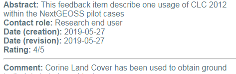
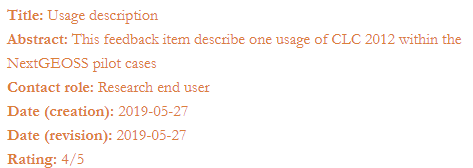
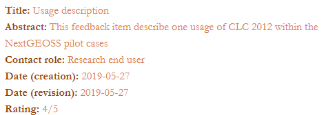
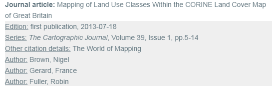
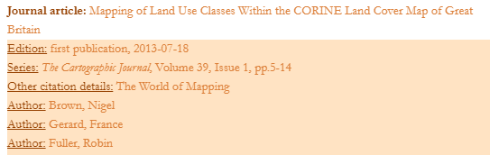
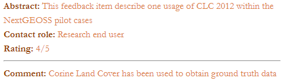
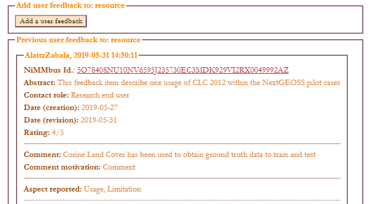

# GUF.css Reference

This page provides a list of the classes defined in the GUF.css style sheet, in order to allow the user to know for which classes they can create a ".XXX.user" class in their style sheet (where "XXX" is substituted by any class name in guf.css) to modify the style of this class.

In fact, all the classes are related to the elements for which they are used (i.e. div, span, legend, fieldset, etc) and thus follow the pattern "YYY.XXX" where YYY is the element (e.g. div) and XXX is the class (e.g. guf_key).

Please note that the style properties described in a "YYY.XXX.user" class are ADDED to the ones described in "YYY.XXX" class. For example as the div.guf_key class describes "font-weight: bold", if div.guf_key.user class describes "color: saddlebrown", resulting text will have this color but also will be in bold.

## General classes

These classes are used all over the feedback items report, and by changing them it will affect to all the elements having this class.

### div.guf_widget
This class is used to describe the style for the division containing the complete feedback items list.

By default is defined as "font-family: 'Gotham Narrow SSm',sans-serif" and font color grey ("color: #66757f").

A typical change that users can make is to change the font family and color as well as the line height, as it has been done in the [test_widget_custom.htm](../client_js/test_widget_custom.htm) example to use "font-family: Garamond", "color: peru" and "line-height: 1.5".

The next table shows the original (in guf.css) and custom (in test_widget_custom.htm) class definition, as well as an example of how the result is displayed.

| Style                                   | Class definition                                                                                                     | Example        |
|------------------------------------|----------------------------------------------------------------------------------------------------------|----------------|
| Original              | div.guf_widget { display: block; font-family: "Gotham Narrow SSm",sans-serif; color: #66757f; } |  |
| Custom | div.guf_widget.user  { line-height: 1.5; color: peru; font-family: Garamond; }                                        | 

### span.guf_key
This class is used to describe the style for the names (titles) of the feedback item elements at first level such as "Title", "Abstract", "Purpose", etc and applies to all of them at the same time.

By default is defined as "font-weight: bold".

A typical change that users can make is to change the font color, as it has been done in the [test_widget_custom.htm](../client_js/test_widget_custom.htm) example to use "color: chocolate".

The next table shows the original (in guf.css) and custom (in test_widget_custom.htm) class definition, as well as an example of a how the result is displayed, including not only the changes described in this table (i.e. font color change for names of the feedback elements) but also the ones described in the previous section for guf_report (i.e. font family and font color for the whole report).

Please note that the style properties are ADDED to the ones described in the original class, and thus as the .guf_key class describes "font-weight: bold" and the .guf_key.user class describes "color: saddlebrown", resulting text will have this color but also will be in bold.

| Style                                   | Code                                                                                                     | Example        |
|------------------------------------|----------------------------------------------------------------------------------------------------------|----------------|
| Original              | span.guf_key { font-weight: bold; } |  |
| Custom | span.guf_key.user { color: saddlebrown; } | 

### span.guf_key_2
This class is used to describe the style for the names (titles) of the feedback item elements at second level such as the elements inside each citation or publication (e.g. "Edition", "Series", "Author", "Online resource",...) or inside a Target description (e.g. "Identifier").

By default is defined as "text-decoration: underline".

A typical change that users can make is to change the font color, as it has been done in the [test_widget_custom.htm](../client_js/test_widget_custom.htm) example to use "color: saddlebrown".

### div.guf_folded
This class is used for the text that contains the detailed description that is initially hidden for citations and publications.

By default is defined as "display: none" and with a grey background ("background: #EEEEEE").

A typical change that users can make is to change this background color, as it has been done in the [test_widget_custom.htm](../client_js/test_widget_custom.htm) example to use "color: bisque".

The next table shows the original (in guf.css) and custom (in test_widget_custom.htm) class definition, as well as an example of a how the result is displayed, including not only the changes described in this table (i.e. font color change for names of the feedback elements) but also the ones described in the previous sections.

| Style                                   | Code                                                                                                     | Example        |
|------------------------------------|----------------------------------------------------------------------------------------------------------|----------------|
| Original              | div.guf_folded { display: none; background: #EEEEEE; } |  |
| Custom | div.guf_folded.user  {  background: bisque; } | 

### input.guf_button

This class is used for the buttons and can be changed to modify button colors (border and background), font, etc, as it has been done in the [test_widget_custom.htm](../client_js/test_widget_custom.htm) example.

### fieldset.guf_fieldset

This class is used for the fieldsets and can be changed to modify the border color, as it has been done in the [test_widget_custom.htm](../client_js/test_widget_custom.htm) example.

### legend.guf_legend

This class is used for the legend in the fieldsets and can be changed to modify for example the font color, as it has been done in the [test_widget_custom.htm](../client_js/test_widget_custom.htm) example.

### hr.guf_dashed and hr.guf_solid

This class is used to change the horizontal line properties for solid and dashed lines, and can be changed to modify for example the line colors, as it has been done in the [test_widget_custom.htm](../client_js/test_widget_custom.htm) example.

### a.guf_link:link, a.guf_link:hover,  a.guf_link:visited

This class is used to change the link properties, and can be changed to modify for example the font colors, as it has been done in the [test_widget_custom.htm](../client_js/test_widget_custom.htm) example.

## Classes related to specific content

Besides the previous general classes, several classes for each feedback item element or section there have been defined. These classes have no property defined, but are used to create a division for each concept or section, and thus, to be able to modify the style of a certain feedback item or especially to hide it.

### List of classes

The list of classes, hierarchically orderer to understand relations (i.e. which elements are within a section), is:

* <u>div.guf_add_fb</u>: division for the first fieldset that includes the button to Add new feedback items.
* <u>div.guf_report</u>: division for the second fieldset that includes the Previous user feedback items, as well as the button to Edit your own.
 * <u>div.guf_fb_id</u>: division for the NiMMbus Id. of the feedback item
 * <u>div.guf_title</u>: division for the Title of the feedback item
 * <u>div.guf_abstract</u>: division for the Abstract of the feedback item
 * <u>div.guf_purpose</u>: division for the Purpose of the feedback item
 * <u>div.guf_contact_role</u>: division for the role of the contact of the feedback item
 * <u>div.guf_date</u>: division for the Dates related to the feedback item (usually creation and revision)
 * <u>div.guf_rating</u>: division for the Rating of the feedback item
 * <u>div.guf_comment</u>: division for the Comment of the feedback item. It includes the comment itself and its motivation
 * <u>div.guf_usage</u>: division for the usage of the feedback item. It includes several elements:
   * <u>div.guf_aspect_reported</u>: division for the Aspect reported in this usage description
   * <u>div.guf_usage_description</u>: division for the specific usage description, it includes several elements:
     * <u>div.guf_spec_usage_description</u>: division for the specific usage description explanation
     * <u>div.guf_usage_dt</u>: division for the usage date and time
     * <u>div.guf_user_deter_limits</u>: division for the user determined limitations
     * <u>div.guf_response</u>: division for the response to the user determined limitations
     * <u>div.guf_add_doc</u>: division for citations containing additional documentation
   * <u>div.guf_discovered_issue</u>: division for the discovered issue description, it includes several elements:
     * <u>div.guf_known_problem</u>: division for the known problem description
     * <u>div.guf_known_problem_dt</u>: division for the date and time when the known  problem was detected
     * <u>div.guf_work_around</u>: division for description about how to work around the problem
     * <u>div.guf_ref_doc</u>: division for the publications acting as reference documents (exposing the issue and eventually suggesting a solution)
     * <u>div.guf_exp_solution_date</u>: division for the specific usage description explanation
     * <u>div.guf_fix_rsrc</u>: division for citations to fixed resources
     * <u>div.guf_alt_rsrc</u>: division for citations to alternative resources
 * <u>div.guf_public</u>: division for publications that provide an evaluation of the usage of the resource. For each publication the title and category (e.g. book, journal article, report, etc) and a link to unfold (or fold) a detailed description are shown
 * <u>div.guf_target</u>: division for the description of the targets of the feedback item. It includes the target title and its identifier(s)
 * <u>div.guf_edit</u>: division for the button to edit your own previous feedback items

Moreover, for all the elements that are citations or publications (for example guf_add_doc, guf_ref_doc or even guf_public), the elements shown in the extended description can also be selected by using next classes:

* <u>div.guf_cit_edition</u>: division for the edition of the citation, including the series name, the issue identification and the pages
* <u>div.guf_cit_series</u>: division for the series of the citation, including the edition and the edition date
* <u>div.guf_cit_other_citation</u>: division for the other citation details
* <u>div.guf_cit_responsibles</u>: division for the cited responsible parties, including the name and the role for each of them
* <u>div.guf_cit_online_resource</u>: division for the online resource description, including the desription, function and link
* <u>div.guf_cit_identifier</u>: division for citation identifiers
* <u>div.guf_pub_abstract</u>: division for the publication abstract
* <u>span.guf_show_more</u>: span for the "Show more/less information" text, that folds or unfolds the detailed description of the citation or publication

### Examples of use

A first example of use is to <u>hide a certain class</u>, for example the class guf_date. The next table shows the original (in guf.css) and custom class definition, as well as an example of a how the result is displayed, including not only the changes described in this table (i.e. font color change for names of the feedback elements) but also the ones described in the previous sections.

| Style                                   | Code                                                                                                     | Example        |
|------------------------------------|----------------------------------------------------------------------------------------------------------|----------------|
| Original              | div.guf_date{}|  |
| Custom | div.guf_date  { 	display: none; } | 

A second typical example is to change the <u>format of a certain class</u>, for example to change the font of the title to display it in bold and in another color.

The next table shows the original (in guf.css) and custom class definition, as well as an example of a how the result is displayed, including not only the changes described in this table (i.e. font color change for names of the feedback elements) but also the ones described in the previous sections.

| Style                                   | Code                                                                                                     | Example        |
|------------------------------------|----------------------------------------------------------------------------------------------------------|----------------|
| Original              | div.guf_title{}|  |
| Custom | div.guf_title.user { color: GoldenRod; font-weight: bold; } | 

Last example is a general one using <u>many of the options together</u>, modifying the style for all the classes in the general section and some of classes related to specific content section. In fact this example compares the  [test_widget.htm](../client_js/test_widget.htm) and the [test_widget_custom.htm](../client_js/test_widget_custom.htm) examples. Next table shows the same content with the two widget test pages:

| Style                              | Example                                   |
|------------------------------------|-------------------------------------------|
| Original  <i>test_widget.htm</i>      |    |
| Custom  <i>test_widget_custom.htm</i> |      |
