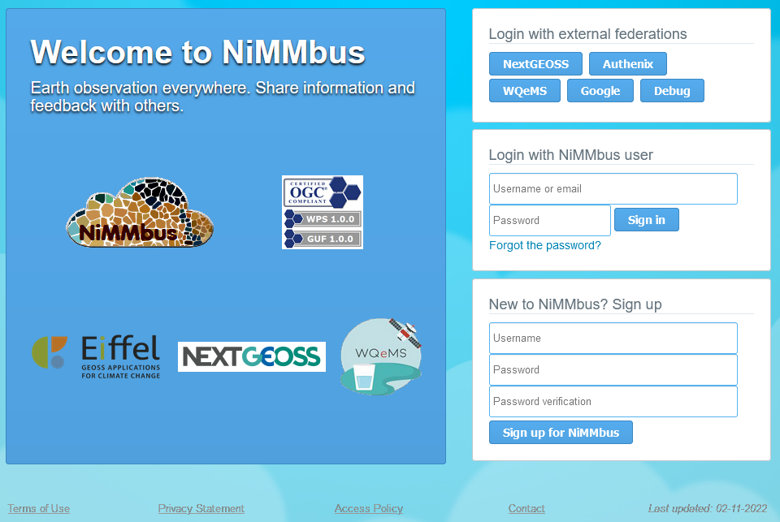

[[Overview]]
== *Overview*

This section describes the NiMMbus system and it’s characteristics. Next subsection describes how to sign-in the system, and the allowed single-sign-on systems for users.

Following sections in the document explain the different pages of the system:

* *Resources*: describes the main page after singing-in: the resource list.
* *Citation & publication*: describes the citation and publication resource pages.
* *Feedback*: describes the feedback resource page and also how to manage feedback items for other resources.
* *User*: describes the user page and also how to share resources with other users.

Each one has a specific form, and user can decide which information fulfil on base of the element.

Moreover, there are two appendices, the first one with the document history (list of versions), and the second one describing test pages created to support in NiMMbus integration in other community portals.

[[Sign-in]]
=== Sign-in in NiMMbus

The Log In page to the system is:

[#2_1_log_in]
.Log in

Several single-sign-one (SSO) systems have been connected:

* NextGEOSS
* Authenix
* WQeMS
* Google

Alternatively, a user in the NiMMbus system can be created to sign-in, only  needing a username and an email, the latter will be the base of each profile.
Once a new _user_ has been created, is possible to _Log in_ into NiMMbus.

More details about user creation and management of your profile are included in the +++<a href="#User">User</a>+++ section.
