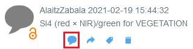
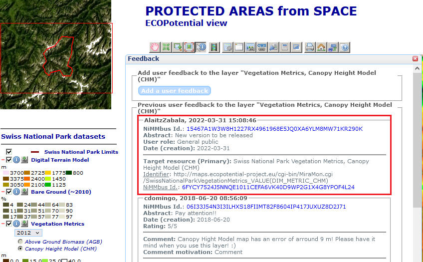
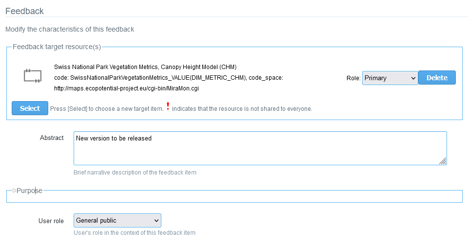

[[Feedback]]
== *Feedback*

A geospatial feedback item can be understood as any *comment or information about a geospatial resource*, both quantitative and/or qualitative, made to share a personal experience when using a specific dataset or a recommendation about it. It may help other users to improve the identification and usefulness of datasets, to resolve problems with datasets, to share personal comments about quality of dataset, to report positive and negative experiences using the resource or to find new usages of the data, among many other possibilities.

Anyone who has been working with a geospatial dataset can provide feedback about it, regardless of the area of expertise they come from, as users with different backgrounds can assess the dataset from several points of view. This can be useful for users by gaining access to the experience of others, and also for the producers of the datasets, who can discover new uses of or receive hints to improve their resources, among others.

One of the main objectives is to build a network of feedbacks associated with the experience of users with different datasets, in order to collectively generate knowledge, facilitating a “user-centric" approach and being able to transmit and share it.

[[Managing_Feedback]]
=== Managing feedbacks of a resource

//In remote sensing applications, when a scene or sheet of a product is used, we found it useful to make the primary target point to the specific scene used and the secondary target to the complete product or time series.
There are two ways to create a feedback item on NiMMbus: one is within NiMMbus website, the other one is integrating the NiMMbus widget on a geospatial platform. Both options are explained next.

==== Within stand-alone-NiMMbus

To create a new Feedback on NiMMbus, there must be a resource already created, which will be the target of the new feedback item. Feedback can be given about any of the resource types recently shown (citation, publication, hyperlink, point of interest, etc), even about another feedback item. 

There are two options to generate a new feedback item: to create a new resource and then create a feedback item about this newly created resource, or to add a feedback item to a resource already created by someone else (or by us).

Once the resource exists, find it in the list of resources and click on the _Feedback icon_, which is under the resource name and looks like a _dialog cloud_, as shown in red square at the image below.

.Feedback button on Resources list

==== When NiMMbus is integrated in other portals

The other option for creating a Feedback item about a target resource, is to integrate the NiMMbus widget into other geospatial platforms. This is generally the preferred options, as the feedback items are created linked to a current geospatial service or catalogue such as it has been done in the +++<a href="https://catalogue.nextgeoss.eu/" target="_blank">NextGEOSS catalogue</a>+++ created in the +++<a href="https://nextgeoss.eu/" target="_blank">NextGEOSS H2020 project</a>+++, +++<a href="http://maps.ecopotential-project.eu/" target="_blank">Protected Areas from space</a>+++ web map browser created in the +++<a href="http://www.ecopotential-project.eu/" target="_blank">ECOPotential H2020 project</a>+++, or an internal web map browser in the +++<a href="https://wqems.eu/" target="_blank">WQeMS H2020 project</a>+++. 

The feedback creation through the widget is associated to a specific resource from the beginning, and also implies the automatic creation of the citation to this resource, easing the process for the final user. 

There are three steps to integrate the widget. The first one is to include the JavaScript library in the HTML page, the second one to create a division or a window to contain the feedback, and finally to fill in the division (or window) with the widget. More details for the widget integration are explained on +++<a href="https://github.com/joanma747/nimmbus" target="_blank">NiMMbus GitHub</a>+++.

.Example of the Feedback widget on the ECOPotential project web map browser

.One of the feedback items from the previous example from ECOPotential, as viewed on NiMMbus

[[Feedback_elements]]
=== Feedback elements

Feedback repository is organized in 5 subsections, to be explained:

*FEEDBACK TARGET RESOURCE(S)*

* *_Role_*: To identify the type of target a certain resource is. With a dropdown list, there are three options to choose.
  - Primary role: Points to the resource(s) the feedback it is mainly about. i.e. the specific scene or layer (or other) used.
  - Secondary Role: Point to the resource(s) the feedback is also related to, usually not as directly as for a primary target, but for the feedback item is also relevant. i.e. the complete product or time series.
  - Supplementary Role: For additional references. i.e. another dataset with similar problems.

---
* *_Abstract_*: Brief narrative description, to help other users to understand the summary of the contribution.

---

*PURPOSE*

* *_Purpose_*: Is a non-quantitative description to explain the rationale for creating a feedback item and contains information about its intended use.

* *_User role_*: This is a set of dropdown choices to characterize the one giving feedback, as: Commercial data producer, Commercial added value, Scientific data producer, Research end user, Decision maker, and general public.

* *_Rating_*: Evaluation space, showing 1-5 stars, to subjectively rank the target resources. The idea is to help others on identifying satisfaction with the resource about which the feedback us given.

---
*USER COMMENT*

* *_User comment_*: Area for commenting about the target resource(s) resource. In this section there is also a dropdown option, namely Comment motivation,  to select the type of comment about the resource. The options are: Comment, Question, Answer, Accepted answer, Response, Justification, Resolution, and Moderation.

---

*USAGE*

This section describes the application(s) for which a dataset (the target resource(s)) has been used by the data producer or by other, distinct, data users. It has several elements to be fulfilled:

•	Aspect reported: To describe the aspect (facet) that the feedback item is covering about the target resource(s). One or many options can be selected from the following list: Usage, Fitness for purpose, Limitation, Alternative, and/or Problem. Depending on which report aspects have been selected, some elements below or others should be described:

-	Usage: Description of a usage of the target resource. At least one element on 'Usage description' should be defined.

-	Fitness for purpose: Description of a usage of the target resource that was appropriated for the intended purpose. At least one element on 'Usage description' should be defined.

-	Limitation: Description of a limitation of the target resource. At least one 'User determined limitations' in 'Usage description' should be defined.

-	Alternative: Alternative route that helps to avoid a problem or a limitation. At least one 'Work around' or one 'Alternative resource' should be defined.

-	Problem: A report of a problem or an issue. At least one 'Discovered issue' should be described.

•	*_Usage description_*: To describe how the target has been used.  This subsection contains several elements such as specific usage description, date and time, user determined limitations, additional documentation and reproducible usage (including code, format, platform...). 

•	*_Discovered issue_*:   To report an error or identified problem with data. This subsection contains several elements such as known problem, date and time, workaround, alternative resources or fixed resource.

