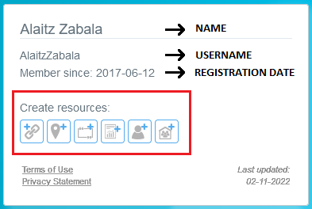
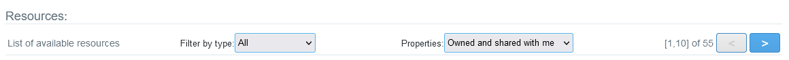
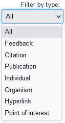
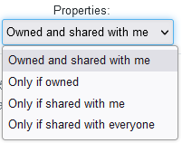

[[Res_How_to]]
== *How to use NiMMbus*

=== Once logged-in in NiMMbus

Main page has two panels, the left panel (with the user information and the options to _create a new resource_) and the right panel (with the list of available _Resources_).

==== Left Panel: User information and options to create a new resource

First part of this panel shows the User Information, as the registration name, the current NiMMbus username and the registration date (this one is the same since the first sign-in). To learn how to modify the username and name, go to the +++<a href="#User">User</a>+++ section.

Second part of this panel has the Resource Creation section (highlighted with a red box in the next figure). There are six buttons to create different resources. From left to right the presentation order is: +++<a href="Res_hyperlink">New Hyperlink</a>+++, +++<a href="#Res_PoI">New point of interest</a>+++, +++<a href="#Citation">New Citation</a>+++, +++<a href="#Publication">New Publication</a>+++, +++<a href="#Res_responsible_party">New Individual</a>+++ and +++<a href="#Res_responsible_party">New Organization</a>+++.

.Left Panel

Third part of left panel, and below the resource creation buttons, is for two important links related to the operation of NiMMbus: +++<a href="https://www.nimmbus.cat/TermsOfUse.htm" target="_blank">Terms of use</a>+++ & +++<a href="https://www.nimmbus.cat/PrivacyStatement.htm" target="_blank">Privacy Statement</a>+++. Each of them define the parameters for working with NiMMbus. Please read them both carefully. 

_Terms of Use_ governs the operations of NiMMbus and includes several sections: Accounts, Links To Other Web Sites, Termination on NiMMbus, Governing Law, Changes on Terms of Use & Contact. As this is a document that is on constantly revision, the last updated date its also indicated.

_Privacy Statement_ informs the user about NiMMbus policies regarding the collection, use and disclosure of Personal Information at the moment of using the platform. It includes the following sections: Information Collection And Use, Log Data, Security, Links To Other Sites, Changes To This Privacy Statement, Contact.

==== Right Panel: Resources List

This part of the main page shows the list of resources displayed from the most recently modified to the oldest resource. 

The _resource filter bar_ has three sections: two resource filters and the _resource page selector_. The filters are two drop-down variables: *Type* and *Properties*. Each combination of them shows the available resources on the displayed list, always ordered from the most recent to the last modified item. To see more resources than the ones shown in the first place, it is possible to move to next page of resources, with the buttons at the right top of the _resources selecting bar_.

.Resources filters bar

_Type_ filter, is for choosing resources according to its category, like a _Citation_, _Publication_, _Individual_, _Organism_, _Hyperlink_, a _Feedback_, or _All_, to see all types of resources. 

.Filter by type dropdown list

_Properties_ filter is related to the one who has created the resource or if it has been shared to the user. The options for selecting a resource are: first of all resources owned by the user or directly shared with him/her; second option to show only the resources owned by the user; third option to display only the resources shared with the user; and finally las option to see only the public resources.

.Filter by properties dropdown list

By default, the resource list shows in the first place _"All"_ as Type category, and _"Owned and shared with me"_ as Property type. Once selected the filters, the available resources list will change as the number of total resources will change too.

